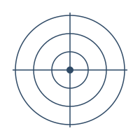
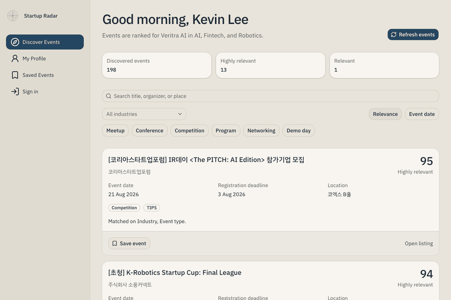
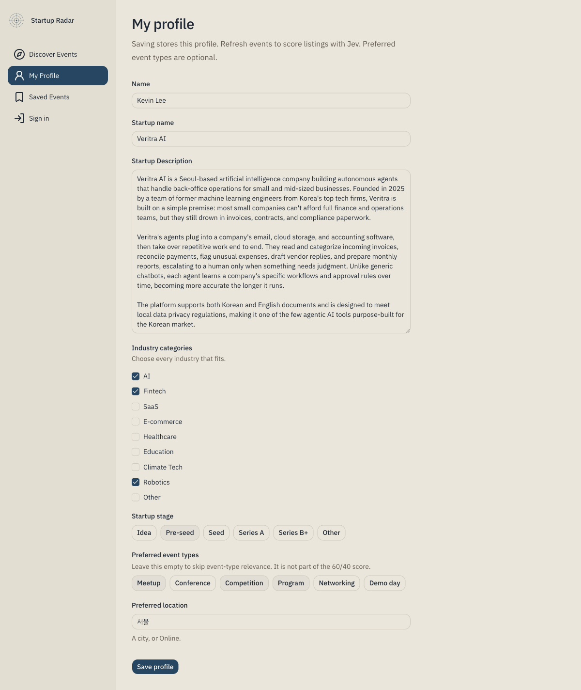
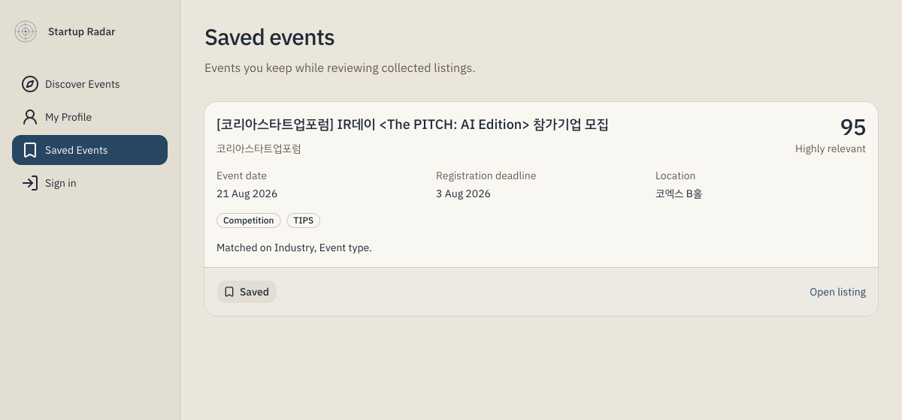

<p align="center">
  
</p>

<h1 align="center">Founder's Radar</h1>

<p align="center">한국 창업자를 위한 맞춤형 스타트업 행사 탐색 서비스입니다.</p>

<p align="center">
  <a href="https://nextjs.org/"></a>
  <a href="https://www.typescriptlang.org/"></a>
  
</p>

<p align="center">
  <a href="#화면">화면</a> ·
  <a href="#개요">개요</a> ·
  <a href="#기능">기능</a> ·
  <a href="#시작하기">시작하기</a> ·
  <a href="#실행-모드">실행 모드</a> ·
  <a href="#supabase-설정">Supabase</a> ·
  <a href="#openrouter와-jev">Jev</a> ·
  <a href="#이벤트-소스">이벤트 소스</a> ·
  <a href="#관련도-점수">관련도 점수</a> ·
  <a href="#프로젝트-구조">구조</a> ·
  <a href="#알려진-한계">한계</a>
</p>

창업자 프로필에 맞춰 국내 스타트업 행사를 모으고, 관련도를 계산한 뒤 이유를 함께 보여 줍니다. 기본값은 데모 모드입니다. Supabase와 OpenRouter 없이도 샘플 프로필과 데모 목록으로 순위를 바로 확인할 수 있습니다.

> [!TIP]
> 자격 증명 없이 확인하려면 `npm install` 후 `npm run dev`를 실행하고 [http://localhost:3000](http://localhost:3000)을 여세요.

## 화면

아래는 로그인한 로컬 화면입니다. 녹화는 행사 탐색, 프로필, 저장 목록 순서로 넘어갑니다.



### 행사 탐색

점수가 높은 공고부터 보여 주고, 일치한 기준을 카드에 적습니다.


### 프로필

산업, 단계, 선호 지역, 스타트업 설명을 저장합니다. 선호 행사 유형은 비워 둘 수 있습니다.



### 저장한 행사

탐색 목록에서 저장한 공고만 따로 봅니다.



## 개요

Startup Radar는 다음 네 부분으로 이루어집니다.

- **웹 앱.** Next.js App Router, TypeScript, Tailwind CSS, shadcn/ui로 만든 화면입니다. 행사 탐색, 프로필, 저장한 행사, 로그인을 제공합니다.
- **수집.** [TIPS](https://jointips.or.kr)와 [K-Startup](https://www.k-startup.go.kr) 공고를 공통 행사 스키마로 맞추고, 출처 URL 기준으로 중복을 제거합니다.
- **평가.** Supabase 모드에서는 [OpenRouter](https://openrouter.ai)의 Decisions API로 Jev를 호출합니다. 데모 모드에서는 같은 인터페이스의 데모 매처를 사용합니다.
- **저장.** Supabase PostgreSQL에 프로필, 행사, 평가, 저장한 행사를 둡니다. 데모 모드에서는 프로세스 메모리에 둡니다.

화면은 Jev를 직접 호출하지 않습니다. 평가는 서버의 관련도 제공자만 담당합니다.

## 기능

- 산업, 단계, 선호 지역, 선호 행사 유형, 스타트업 설명을 담은 창업자 프로필
- 0–100 관련도 점수와 사람이 읽을 수 있는 설명
- 데모 데이터와 실제 공고의 구분. 데모 카드에는 `Demo data`가 표시됩니다
- 원본 상세 URL과 출처 이름 유지. 소스에 없는 날짜, 주최, 설명은 비워 둡니다
- 저장한 행사 목록
- 수집과 평가 진행 상태를 보여주는 새로고침
- Supabase Auth 이메일 로그인과 로그아웃

## 시작하기

### 사전 준비

- [Node.js 20](https://nodejs.org/) 이상
- npm

Supabase와 OpenRouter는 실제 저장과 Jev 평가를 쓸 때만 필요합니다.

### 로컬에서 실행

```bash
npm install
npm run dev
```

브라우저에서 [http://localhost:3000](http://localhost:3000)을 엽니다. 데모 모드에는 샘플 프로필(Mina Cho, Harbornote)과 표시가 붙은 데모 행사 목록이 로드됩니다.

환경 변수가 필요하면 `.env.example`을 `.env.local`로 복사합니다. `APP_MODE=demo`이거나 Supabase URL·anon key가 비어 있으면 데모 모드로 유지됩니다.

```bash
npm test
npm run lint
npm run build
```

| 스크립트 | 역할 |
| --- | --- |
| `npm run dev` | 개발 서버 |
| `npm test` | 수집, K-Startup, 새로고침, Jev 단위 테스트 |
| `npm run lint` | ESLint |
| `npm run build` | 프로덕션 빌드 |
| `npm start` | 빌드 결과 실행 |

> [!NOTE]
> `.env`와 `.env.local`은 Git에 포함되지 않습니다. 키는 `.env.example`의 이름만 참고하고, 실제 값은 로컬에만 두세요.

## 실행 모드

`getDataMode()`가 모드를 결정합니다. `APP_MODE=supabase`이고 `NEXT_PUBLIC_SUPABASE_URL`과 `NEXT_PUBLIC_SUPABASE_ANON_KEY`가 모두 있을 때만 Supabase 모드입니다.

| `APP_MODE` | 동작 |
| --- | --- |
| `demo` (기본값) | 메모리 카탈로그와 데모 매처. 자격 증명 없음 |
| `supabase`, URL 또는 anon key 없음 | 데모 모드로 동작 |
| `supabase`, URL과 anon key 있음 | Supabase에 저장. 새로고침할 때 Jev로 평가 |

| 경로 | 화면 |
| --- | --- |
| `/` | 행사 탐색 |
| `/profile` | 내 프로필 |
| `/saved` | 저장한 행사 |
| `/sign-in` | 로그인. Supabase 모드 탐색에 표시됩니다 |

데모 모드에서 프로필을 저장하면 현재 목록을 즉시 다시 순위화합니다. 새로고침은 목록을 다시 수집합니다. Supabase 모드에서 프로필 저장은 프로필만 기록하고, 새로고침이 Jev 평가를 요청합니다.

> [!IMPORTANT]
> 회원가입 화면은 없습니다. Supabase Authentication에 이미 있는 이메일 계정으로 로그인합니다. 세션이 없으면 새로고침은 로그인을 요구하고 공고를 저장하지 않습니다.

## Supabase 설정

1. Supabase 프로젝트를 만듭니다.
2. `supabase/migrations`의 SQL을 파일 이름 순서대로 실행합니다.
3. `.env.local`에 아래 값을 넣습니다.

```bash
NEXT_PUBLIC_SUPABASE_URL=https://your-project.supabase.co
NEXT_PUBLIC_SUPABASE_ANON_KEY=your-anon-key
SUPABASE_SERVICE_ROLE_KEY=your-service-role-key
APP_MODE=supabase
```

anon key는 브라우저에 노출되는 공개 키입니다. service role key는 서버 전용이며, 수집한 행사를 쓸 때 사용합니다. `NEXT_PUBLIC_` 접두사를 붙이지 마세요.

프로필, 저장한 행사, 점수는 로그인한 사용자 단위로 저장됩니다.

## OpenRouter와 Jev

Jev는 서버에서만 호출합니다.

```text
POST https://openrouter.ai/api/alpha/decisions
```

```bash
OPENROUTER_API_KEY=your-openrouter-key
JEV_MODEL=typesafe/jev-1.13
```

`JEV_MODEL`은 Decisions API용 모델 ID입니다. 채팅 완료 경로의 모델 이름이 아닙니다. 기본값은 `typesafe/jev-1.13`입니다.

Jev는 Supabase 모드에서만 사용됩니다. `OPENROUTER_API_KEY`가 없으면 평가를 중단하고 그 메시지를 보여 줍니다. 임의로 Jev 점수를 만들지 않습니다.

평가는 행사당 Decisions API를 한 번 호출하고, 동시에 최대 30건까지 진행합니다. 호출이 실패하면 그 새로고침의 평가 결과는 저장되지 않습니다.

> [!WARNING]
> `OPENROUTER_API_KEY`와 `SUPABASE_SERVICE_ROLE_KEY`, `KSTARTUP_API_KEY`는 서버 전용입니다. `NEXT_PUBLIC_`로 시작하면 브라우저 번들에 포함됩니다.

## 이벤트 소스

새로고침은 두 실소스를 동시에 읽고, 각 소스에서 최신 1페이지(최대 100건)를 가져옵니다.

| 소스 | 접근 | 비고 |
| --- | --- | --- |
| [TIPS](https://jointips.or.kr) | 공개 행사 API. 키 없음 | 상세 URL을 유지합니다 |
| [K-Startup](https://www.k-startup.go.kr) | 공공데이터포털 `getAnnouncementInformation01` | `KSTARTUP_API_KEY`가 필요합니다 |

```bash
KSTARTUP_API_KEY=your-data-go-kr-key
```

키가 없거나 한 소스가 응답하지 않으면 그 소스만 실패로 기록됩니다. 다른 소스가 성공하면 그 공고는 저장됩니다.

정규화 규칙:

- 모든 공고는 공통 행사 스키마로 맞춥니다.
- 같은 출처 URL은 하나로 합칩니다.
- 날짜, 주최, 설명, 산업 태그가 없으면 빈 값으로 둡니다. 앱이 값을 채우지 않습니다.
- 해석할 수 없는 날짜는 화면에 `Date not listed`로 표시됩니다.

데모 카탈로그는 두 경우에 쓰입니다. 아직 새로고침하지 않았을 때, 그리고 실소스가 모두 실패했는데 저장소에 공고가 없을 때입니다. 실공고가 하나라도 있으면 데모 카드는 순위 목록에서 빠집니다. 이미 저장된 공고가 있는 상태에서 소스가 실패하면 그 공고를 유지하고, 데모 카탈로그로 바꾸지 않습니다.

## 관련도 점수

점수는 0에서 100 사이입니다. 설명에는 어떤 기준이 맞았는지가 함께 나옵니다.

### 데모 매처

데모 모드의 가중치는 Startup Radar 설정입니다.

| 기준 | 배점 |
| --- | --- |
| 산업 겹침 | 55 |
| 선호 지역 | 20 |
| 단계와 행사 유형 | 15 |
| 행사 유형 | 10 |

설명 문장은 데모 점수라고 밝히며, Jev 판정이라고 하지 않습니다. TIPS 공고에는 이 앱의 산업 태그가 없으므로, 데모 매처는 빈 태그 목록을 산업 일치로 보지 않습니다.

### Jev

Jev는 산업 관련 확률과 단계 관련 선택지를 반환합니다. Startup Radar가 그 값을 하나의 점수로 합칩니다. 아래 비율은 이 앱의 가중치이며, Jev가 정한 배점이 아닙니다.

두 판정이 모두 있을 때:

```text
점수 = round(산업 확률 × 60 + 단계 확률 × 40)
```

단계 판정이 `not_stated`이면 단계 점수는 빼고, 산업 확률만 사용합니다.

```text
점수 = round(산업 확률 × 100)
```

빠진 단계를 0점으로 넣지 않습니다. 프로필에 선호 행사 유형이 있을 때만 유형 일치 여부를 묻고, 그 결과는 일치 기준으로 표시합니다. 60/40 비율은 바뀌지 않습니다.

탐색 화면의 집계도 이 앱의 기준입니다. 75점 이상은 Highly relevant, 70점 초과 75점 미만은 Relevant입니다.

## 프로젝트 구조

```text
src/app                 페이지와 /api/refresh
src/components          화면 컴포넌트
src/lib/ingestion       TIPS, K-Startup, 데모 소스와 새로고침
src/lib/relevance       Jev 클라이언트와 데모 매처
src/lib/scoring         데모 가중치와 Jev 가중치
src/lib/db              데모 저장소와 Supabase 저장소
src/lib/auth            로그인 서버 액션
src/types               행사와 프로필 타입
supabase/migrations     테이블, RLS, 프로필 컬럼
```

## 알려진 한계

- 데모 데이터는 서버 메모리에 있으며, 프로세스가 다시 시작되면 초기 상태로 돌아갑니다.
- 한 번의 새로고침은 소스마다 최대 100건입니다. 전체 공고 목록을 가져오지 않습니다.
- 첫 평가 실행은 목록 전체를 새로 발견한 행사로 표시하지 않습니다. 직전 평가 시각보다 나중에 처음 본 공고만 해당합니다.
- Jev 호출이 중간에 실패하면 그 실행의 평가 결과는 저장되지 않습니다.
- 다른 행사 소스는 연결되어 있지 않습니다.
